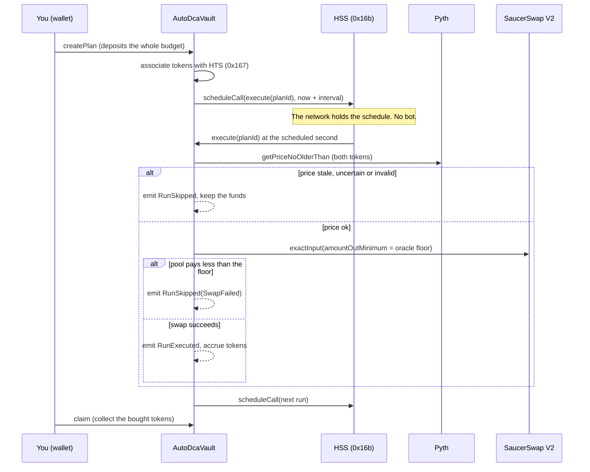

# SaucerSwap Auto-DCA for Hedera

Recurring token buys on **SaucerSwap V2** that run themselves. No keeper bot, no cron job, no server.

- The **Hedera Schedule Service (HSS)** wakes the contract up for every purchase.
- **Pyth** prices both tokens before each swap. If the price is stale, uncertain or the pool is paying less than the oracle allows, the purchase is **skipped** instead of executed.
- **HTS** tokens are deposited, held and claimed by the vault (including the association step that trips up most newcomers).
- Every run emits an on-chain event that the Hedera **mirror node** serves, which is the audit trail the web app shows.
- An **optional relay** republishes those events to a **Hedera Consensus Service (HCS)** topic, giving you a tamper-evident public log that only your relay can write to.

A Next.js app lets you create a plan, watch the cadence of purchases, and see exactly why a run was skipped.

> **Status:** testnet is live. Mainnet is fully configured but switched off ("coming soon") until you open it deliberately. See [Networks](#networks-testnet-live-mainnet-coming-soon).

## Judge's five-minute tour

1. **See the safety logic:** open [`AutoDcaVault.sol`](packages/hardhat/contracts/AutoDcaVault.sol) and read `execute`, `_evaluate` and `_trySwap`. That is the whole idea: price both tokens, set a floor, swap or skip, schedule the next run.
2. **See it tested:** run `npm test`. 24 of the 43 Hardhat tests exercise the vault itself: every skip reason, the five-skip circuit breaker, scheduling failures and access control.
3. **See the network gating:** run `npm run setup` and try to pick Mainnet. It is listed, labelled "coming soon", and refused.
4. **See it live (needs testnet HBAR):** follow Steps 7 to 11 below, then open the vault's Events tab on HashScan after one interval.
5. **See the audit trail:** run the optional relay in [Step 13](#step-13-optional-publish-the-audit-trail-to-hcs) and open the topic on HashScan.

## Contents

1. [How it works](#how-it-works)
2. [Prerequisites](#prerequisites)
3. [Step-by-step setup](#step-by-step-setup)
4. [Networks](#networks-testnet-live-mainnet-coming-soon)
5. [Configuration reference](#configuration-reference)
6. [Contract reference](#contract-reference)
7. [Safety model and limits](#safety-model-and-limits)
8. [What is tested, and what you must verify on testnet](#what-is-tested-and-what-you-must-verify-on-testnet)
9. [Troubleshooting](#troubleshooting)
10. [Project structure](#project-structure)
11. [How this differs from the built-in templates](#how-this-differs-from-the-built-in-templates)

## How it works



More detail, including the plan state machine, is in [docs/ARCHITECTURE.md](docs/ARCHITECTURE.md).

**Why a guard instead of a plain swap?** A DCA bot that buys at any price will happily buy into a broken pool. The vault derives a minimum acceptable output from two Pyth prices and passes it to the router as `amountOutMinimum`. A bad pool price makes the router revert, and the vault records a skip instead of losing money. After five skips in a row the plan pauses itself so it cannot burn gas forever.

**A note on Pyth and autonomy.** Pyth is a *pull* oracle: prices only exist on-chain after somebody pushes a signed update. A scheduled run cannot fetch one from the internet, so it uses the newest price already on-chain and skips if it is older than your *max price age*. The app's **Refresh price** button (or anyone calling `refreshPrice`) keeps it fresh. This is a property of Pyth, not a bug, and the skip behaviour makes it safe.

## Prerequisites

Install or create each item below before you start. Commands assume macOS, Linux or Windows with WSL.

| # | You need | Why | How to get it / check it |
|---|----------|-----|--------------------------|
| 1 | **Node.js 20.18.3 or newer** | Runs the scaffold CLI, Hardhat and Next.js | Download from https://nodejs.org. Check with `node -v`. |
| 2 | **npm** (ships with Node) or Yarn | Installs dependencies | Check with `npm -v`. |
| 3 | **Git**, with your name and email set | The scaffold CLI initialises a repository | `git --version`, then `git config --global user.name "Your Name"` and `git config --global user.email "you@example.com"` |
| 4 | **An EVM wallet** such as MetaMask | Signs transactions in the web app | https://metamask.io. The app adds the Hedera testnet network for you. |
| 5 | **A Hedera Portal account with an ECDSA key** | Gives you a deployer account and testnet HBAR | Sign up at https://portal.hedera.com, create an **ECDSA** account, copy its **HEX encoded private key**. |
| 6 | **Testnet HBAR** | Pays for deploying and for scheduled-run gas | Faucet: https://portal.hedera.com/faucet. About 50 HBAR is plenty. |
| 7 | **Two HTS tokens that share a SaucerSwap V2 pool on testnet** | The pair you will buy and sell | See [Step 8](#step-8-choose-your-token-pair-and-price-feeds). You need the **EVM address** of each token. |
| 8 | **Two Pyth price feed IDs** (USD pairs for those tokens) | The price guard | List: https://docs.pyth.network/price-feeds/core/price-feeds/price-feed-ids |
| 9 | *(Optional)* **A Pyth API key** | Lets the app push fresh prices on-chain | Hermes now requires a key: https://docs.pyth.network/price-feeds/core/upgrade/preparing. `npm run setup` asks for it (Step 3). Without it everything else works. |
| 10 | *(Optional)* **Your Hedera account ID** (`0.0.12345`) | Only for the HCS audit relay, which pays for topic messages | Shown in the Hedera Portal next to your ECDSA account. |

Not needed: an LLM API key, Docker, or Foundry. This template uses Hardhat only.

## Step-by-step setup

Every command is run in a terminal. Lines starting with `#` are comments, not commands.

### Step 1. Create the project

```bash
npm create scaffold-hbar@latest my-auto-dca -- --template YOUR-GITHUB-NAME/YOUR-REPO-NAME
```

Replace the template argument with the `owner/repo` of the public GitHub repository that contains this project (the repository slug is `scaffold-hbar-saucerswap-auto-dca`).

> **Do not drop the `--` before `--template`.** npm swallows flags that come before it, so `npm create scaffold-hbar@latest --template owner/repo` silently builds the *default* template instead of this one. A GitHub pull request on the scaffold-hbar repository documents the same pitfall, and the bounty brief's example command omits the `--`. `npx create-scaffold-hbar@latest --template owner/repo` also works. When the CLI asks you questions, choose **Next.js**, **Hardhat** and **npm** (these are the only options this template allows). The CLI offers a network prompt too: choose **testnet**. See [Networks](#networks-testnet-live-mainnet-coming-soon) for why.

Then move into the new folder:

```bash
cd my-auto-dca
```

*Working from a downloaded zip instead?* Unzip it, `cd` into the folder, and continue at Step 2.

### Step 2. Install dependencies

```bash
npm install
```

This takes a few minutes. It installs all three packages (`config`, `hardhat`, `nextjs`) at once.

### Step 3. Run the setup wizard

```bash
npm run setup
```

It asks two things:

1. **Which network to use.** Press `1` for testnet. If you press `2`, it tells you mainnet is coming soon and asks again.
2. **Your Pyth API key (optional).** Paste it (nothing is shown on screen as you type) or press Enter to skip. Pyth's Hermes service needs a key to push fresh prices on-chain; get a free trial at https://docs.pyth.network/price-feeds/core/upgrade/preparing. The key is stored only in `packages/nextjs/.env.local`, is read by the server only and is never sent to the browser. Skipping is fine: everything works except the **Refresh price** button.

It then creates two local files from the examples:

- `packages/hardhat/.env` (holds your deployer key)
- `packages/nextjs/.env.local` (holds the web app settings, including your Pyth key if you gave one)

Both are git-ignored, so you cannot commit them by accident. Re-running the wizard never overwrites a file you edited: it only updates a value that changed. To add a key later without the prompt, run `npm run setup -- --pyth-key YOUR_KEY`.

### Step 4. Add your deployer key

Pick **one** option.

**Option A: use your Hedera Portal account (recommended).** Open `packages/hardhat/.env` and paste your HEX private key after `DEPLOYER_PRIVATE_KEY=`. It must be 64 hex characters (a leading `0x` is fine). Do not use a DER-encoded key (a long string starting `3030...`).

**Option B: generate a fresh key.**

```bash
npm run hardhat:account
```

This writes a new key into `packages/hardhat/.env` and prints its EVM address.

### Step 5. Fund the deployer

- Option A: your Portal account already has HBAR if you used the faucet.
- Option B: send testnet HBAR to the printed address from your Portal account. The account is created on Hedera the first time it receives HBAR.

### Step 6. Run the tests (about one minute, no network or HBAR needed)

```bash
npm test
```

You should see everything pass: **8 setup tests**, **6 config tests**, **43 Hardhat package tests** and **33 web app tests**. The contract tests replace the Hedera system contracts with mocks, because the Schedule Service does not exist on a local node.

### Step 7. Deploy the vault to testnet

```bash
npm run hardhat:deploy
```

On success it prints the vault address and HashScan links, sends 5 HBAR to the vault for scheduled-run gas, and records the address in `packages/hardhat/deployments/testnet.json` and `packages/nextjs/lib/deployments.json`. The web app reads the second file.

Optional settings (put them in `packages/hardhat/.env`): `FUND_HBAR`, `SCHEDULED_CALL_GAS_LIMIT`, `MIN_INTERVAL_SECONDS`.

**Keep the printed deploy transaction link.** It is part of your submission evidence.

### Step 8. Choose your token pair and price feeds

1. **Pick two HTS tokens that already share a SaucerSwap V2 pool on testnet.** Open the SaucerSwap testnet app, look at its pools, and note a pair that has liquidity. Convert each token's Hedera ID (`0.0.N`) to an EVM address. The simplest way is to open the token on HashScan (https://hashscan.io/testnet) and copy the **EVM address** field, or run:

   ```bash
   node -e "console.log(require('./packages/config').idToEvmAddress('0.0.1183558'))"
   ```

   (That example converts the testnet SAUCE token ID.)
2. **Pick the Pyth feed ID for each token's USD price** from the list linked in the prerequisites table. If a token is a stablecoin, use its USD feed too.
3. **Make sure your account holds the token you plan to sell**, and is **associated** with the token you plan to buy (`TOKEN=0x... npm run hardhat:associate`).

### Step 9. Create your first plan

**From the command line:** add these lines to `packages/hardhat/.env`, filling in your own values:

```bash
TOKEN_IN=0x...          # token you sell (EVM address)
TOKEN_OUT=0x...         # token you buy (EVM address)
POOL_FEE=3000           # 500, 1500, 3000 or 10000
AMOUNT_PER_RUN=1        # whole tokens per purchase
RUNS=3
INTERVAL_SECONDS=120    # 2 minutes, handy for a demo
PRICE_ID_IN=0x...       # Pyth feed ID for the token you sell
PRICE_ID_OUT=0x...      # Pyth feed ID for the token you buy
```

Then run:

```bash
npm run hardhat:demo-plan
```

The script first checks that SaucerSwap really has a pool for your pair and fee tier, so a typo fails loudly instead of silently. It approves the budget and creates the plan.

**From the web app:** do Step 10 first, then use the **New plan** form (it does the same approval and creation from your wallet).

### Step 10. Start the web app

```bash
npm run next:dev
```

Open http://localhost:3000, click **Connect wallet**, and approve the network switch to Hedera testnet. You will see your plans with their cadence strip: one dot per purchase (filled when bought, ringed for the next).

If you skipped the Pyth key in Step 3, the **Refresh price** button will explain that no key is configured. Add `PYTH_API_KEY=...` to `packages/nextjs/.env.local` (or run `npm run setup -- --pyth-key YOUR_KEY`) and restart the app.

### Step 11. Watch it run itself

Wait one interval. Without you doing anything, the Schedule Service calls the vault. Then check:

- the **Recent activity** list in the app (bought, or skipped with the reason),
- the vault's **Events** tab on HashScan: `https://hashscan.io/testnet/contract/<vault address>/events`,
- the scheduled transaction on HashScan, whose "from" is the schedule service, not a wallet.

To see the guard work, set a very tight price age (for example 1 second) and watch a run get skipped with "Price too old".

### Step 12. Collect your purchases

Click **Claim** on a plan. The app associates you with the bought token if needed, then transfers it to your wallet.

### Step 13. Optional: publish the audit trail to HCS

A smart contract cannot write to the Hedera Consensus Service, so this template uses a small **relay**. It reads the vault's events from the mirror node and posts each one as a JSON message to an HCS topic. The topic's *submit key* is your key, so nobody else can add messages, which makes the topic a tamper-evident public log of every purchase and skip.

1. Add your Hedera account ID to `packages/hardhat/.env` (the account that owns `DEPLOYER_PRIVATE_KEY`):

   ```bash
   HEDERA_ACCOUNT_ID=0.0.12345
   ```

2. Publish everything so far:

   ```bash
   npm run hardhat:audit-relay
   ```

   The first run creates the topic, prints its HashScan link and saves its ID (`packages/hardhat/deployments/testnet.json` and `packages/nextjs/lib/deployments.json`). The web app then shows an **HCS audit trail** link. Later runs publish only new events.

3. To keep publishing as events happen, add `RELAY_WATCH=true` to `packages/hardhat/.env` and run the same command. It checks every 30 seconds (`RELAY_INTERVAL_SECONDS`).

What a message looks like (one per event, always under 1000 bytes):

```json
{"v":1,"vault":"0x...","chainId":296,"event":"RunSkipped","planId":"1","args":{"reason":"1"},"txHash":"0x...","consensusTimestamp":"1790000000.123456789"}
```

Good to know:

- **It is an attestation by your relay, not by the contract.** Each record includes the transaction hash, so anyone can check it against the mirror node.
- **Delivery is at-least-once.** If the relay stops between publishing and saving its position, one record can appear twice. Consumers should de-duplicate on `txHash`, `event` and `planId`.
- The relay's resume position is stored locally in `packages/hardhat/deployments/hcs-relay-state.testnet.json` (git-ignored). Delete it to republish from the beginning.

### Before you publish or submit

```bash
npm run lint      # ESLint + TypeScript
npm test          # all tests
npm run build     # compiles contracts, builds the web app
```

Then re-create the project from your GitHub repo with the `npm create scaffold-hbar` command from Step 1 in an empty folder and repeat `npm install`, `npm run lint`, `npm run build`. Confirm there is no `.env` file in your repository (`git ls-files | grep env` should only show `.env.example` files).

## Networks: testnet live, mainnet coming soon

Both Hedera networks are defined in one file, [`packages/config/index.js`](packages/config/index.js): chain IDs, RPC and mirror node URLs, explorer links, the Pyth contract and the SaucerSwap V2 contract IDs. Each network has a `status`:

| Network | Status | What that means in this template |
|---------|--------|----------------------------------|
| Testnet (chain 296) | `live` | Deploy, create plans, run. |
| Mainnet (chain 295) | `coming-soon` | Configured, but every entry point refuses it. |

Where "coming soon" is enforced:

- **Setup wizard** (`npm run setup`): lists Mainnet with a "coming soon" label and will not accept it.
- **Web app**: the network switch shows a disabled Mainnet button with a "Coming soon" tag. If the app is started with `NEXT_PUBLIC_HEDERA_NETWORK=mainnet` it shows a notice and offers no way to connect or sign.
- **Deploy and demo scripts**: `--network hederaMainnet` fails with a clear message (see `packages/hardhat/lib/target.ts`).

**The scaffold CLI's own network prompt.** `create-scaffold-hbar` asks for `testnet` or `mainnet` itself, and a template cannot rename or disable options in that prompt (the `template.json` manifest only controls frontend, Solidity framework and package manager). If a user picks mainnet there, this template still behaves safely, because the checks above do not depend on the CLI's answer.

**To open mainnet later:** change `status` to `"live"` for mainnet in `packages/config/index.js`, review the contract against your own audit standards, set `NEXT_PUBLIC_HEDERA_NETWORK=mainnet`, and deploy with `--network hederaMainnet`. Nothing else needs to change.

## Configuration reference

### `packages/hardhat/.env`

| Variable | Required | Default | Purpose |
|----------|----------|---------|---------|
| `DEPLOYER_PRIVATE_KEY` | to deploy | none | HEX ECDSA private key of the deploying account |
| `HEDERA_TESTNET_RPC_URL` | no | `https://testnet.hashio.io/api` | JSON-RPC endpoint |
| `SCHEDULED_CALL_GAS_LIMIT` | no | `2000000` | Gas given to each scheduled run |
| `MIN_INTERVAL_SECONDS` | no | `60` | Shortest allowed plan interval |
| `FUND_HBAR` | no | `5` | HBAR sent to the vault after deploy, for scheduled-run gas |
| `HEDERA_ACCOUNT_ID` | for the relay | none | Your Hedera account ID (`0.0.N`), which pays for HCS messages |
| `HCS_TOPIC_ID` | no | created on first relay run | Reuse an existing audit topic |
| `RELAY_WATCH` | no | `false` | `true` keeps the relay running |
| `RELAY_INTERVAL_SECONDS` | no | `30` | Polling interval in watch mode |
| `TOKEN_IN`, `TOKEN_OUT`, `POOL_FEE`, `AMOUNT_PER_RUN`, `RUNS`, `INTERVAL_SECONDS`, `MAX_SLIPPAGE_BPS`, `MAX_CONF_BPS`, `MAX_PRICE_AGE`, `PRICE_ID_IN`, `PRICE_ID_OUT` | for `demo-plan` | see `.env.example` | Demo plan parameters |

### `packages/nextjs/.env.local`

| Variable | Required | Default | Purpose |
|----------|----------|---------|---------|
| `NEXT_PUBLIC_HEDERA_NETWORK` | no | `testnet` | `testnet`, or `mainnet` for the coming-soon notice |
| `NEXT_PUBLIC_VAULT_ADDRESS` | no | from `deployments.json` | Use a vault you deployed elsewhere |
| `PYTH_API_KEY` | no | none | Server-side Hermes key, enables **Refresh price** |
| `PYTH_HERMES_URL` | no | `https://hermes.pyth.network` | Hermes endpoint |
| `NEXT_PUBLIC_HCS_TOPIC_ID` | no | from `deployments.json` | Show a link to your audit topic |

### Commands

| Command | What it does |
|---------|--------------|
| `npm run setup` | Network choice and local env files |
| `npm run hardhat:compile` | Compile contracts |
| `npm run hardhat:test` | Contract tests |
| `npm run hardhat:account` | Generate a deployer key |
| `npm run hardhat:deploy` | Deploy the vault to testnet |
| `npm run hardhat:demo-plan` | Create a plan from `.env` values |
| `npm run hardhat:audit-relay` | Publish run events to an HCS topic (optional) |
| `npm run hardhat:abi` | Regenerate the web app's ABI after a contract change |
| `npm run setup -- --pyth-key KEY` | Save a Pyth key without the prompt |
| `npm run next:dev` / `next:build` / `next:start` | Web app |
| `npm run lint` / `test` / `build` | Everything |

## Contract reference

Source: [`packages/hardhat/contracts/AutoDcaVault.sol`](packages/hardhat/contracts/AutoDcaVault.sol).

| Function | Who | What it does |
|----------|-----|--------------|
| `createPlan(params)` | anyone | Validates, associates both tokens, pulls `amountPerRun x runs`, schedules the first run |
| `execute(planId)` | HSS, or anyone once due | Runs the Pyth guard, swaps, records the result, schedules the next run |
| `pausePlan` / `resumePlan` | plan owner | Stop or restart a plan (resume reschedules) |
| `cancelPlan` | plan owner | Stop and refund the unsold tokens |
| `claim` | plan owner | Withdraw bought tokens |
| `refreshPrice(updateData)` | anyone, pays the fee | Push a signed Pyth update on-chain, refunds excess |
| `previewRun(planId)` | view | What `execute` would do now (powers the guard badge) |
| `getPlan`, `getPlanIds` | view | Read plans |
| `withdrawHbar` | contract owner | Recover gas HBAR. Cannot touch user tokens. |

Events: `PlanCreated`, `RunScheduled`, `ScheduleFailed`, `RunExecuted`, `RunSkipped`, `PlanPaused`, `PlanResumed`, `PlanCompleted`, `PlanCancelled`, `Claimed`, `PriceRefreshed`.

## Safety model and limits

- The full budget is deposited up front, so a plan can never spend more than you put in.
- The contract owner can only withdraw the vault's HBAR gas reserve, never user tokens.
- `execute` is permissionless once a plan is due. Callers cannot change amounts, tokens or limits.
- A failed schedule never loses a plan: `ScheduleFailed` is emitted, `scheduled` becomes `false`, and anyone can call `execute` when it is due.
- Cancelled, paused and finished plans ignore stale scheduled calls silently.
- This is a **reference design, not audited**. Do not put real funds into a deployment of it without a professional review.

## What is tested, and what you must verify on testnet

**Verified automatically (run `npm test`):**

- 24 vault tests covering plan creation and validation, HSS scheduling and retries, the busy-second search, execution accounting, every skip reason, the five-skip circuit breaker, pause, resume, cancel, claim, access control, oracle refresh and refunds, and the HBAR admin path.
- 6 deploy-helper tests (key parsing and the mainnet guard) and 1 drift test that fails if the web app's ABI no longer matches the compiled contract.
- 12 relay tests: event decoding, ordering and resuming inside a transaction, message size limits, and the Hedera SDK transaction builders (built and frozen offline).
- 33 web app tests covering formatting, form validation, mirror node log decoding, activity text, network gating and both API routes.
- 8 setup tests: network gating, saving the Pyth key without ever printing it, and safe re-runs.
- 6 config tests for the Hedera ID to EVM address conversion and the network registry.

**Not verifiable without a live network. Check each one on testnet and fix the template if the result differs:**

1. **A real scheduled execution.** The Hardhat network has no HSS, so tests use a mock placed at `0x16b`. Confirm that after one interval the vault runs by itself, and that `SCHEDULED_CALL_GAS_LIMIT` (2,000,000) is enough for your pair.
2. **A real SaucerSwap swap** for your pair, including that the router can pull the approved tokens from the vault.
3. **Your Pyth feed IDs.** The template ships no defaults on purpose. A wrong ID makes every run skip as "Price too old".
4. **Pyth fee units.** `refreshPrice` assumes `getUpdateFee` returns the EVM's native unit (tinybar) and the app sends double the fee converted to weibar, with the vault refunding the excess. If the transaction fails with an insufficient-fee or insufficient-balance error, adjust `TINYBAR_TO_WEIBAR` in `packages/nextjs/lib/wallet.ts`.
5. **Token association from your wallet** (`associate()` and `isAssociated()` from HIP-719) as used by **Claim** and `npm run hardhat:associate`.
6. **The mirror node log response shape and the `timestamp=gte:` filter** used by the activity feed and the relay. Both are tested against fixtures only. If the feed stays empty, plan data still loads from the chain.
7. **Publishing to a real HCS topic.** The relay's SDK calls are validated offline, but creating a topic and submitting messages needs your funded account. Run `npm run hardhat:audit-relay` and confirm the messages appear on HashScan.

## Troubleshooting

| Symptom | Likely cause | Fix |
|---------|--------------|-----|
| `DEPLOYER_PRIVATE_KEY must be a 32-byte hex string` | You pasted a DER key or an account ID | Use the HEX encoded ECDSA private key (64 hex characters) |
| Deploy fails with `INSUFFICIENT_PAYER_BALANCE` | Deployer has no HBAR | Use the faucet, then retry |
| `Hedera mainnet is coming soon` | You targeted mainnet | Use `--network hederaTestnet` (the npm scripts already do) |
| `No SaucerSwap V2 pool for this pair` | No pool at that fee tier | Try another `POOL_FEE`, or another pair |
| Transaction reverts with `AssociationFailed` | HTS association rejected | Check the token addresses are HTS tokens, not ordinary contracts |
| Revert on `claim` with a token association error | Your wallet is not associated with the bought token | The app does this automatically. From the CLI run `TOKEN=0x... npm run hardhat:associate` |
| A plan shows "Waiting for a manual run" | HSS could not schedule (busy or failed) | Click **Run now** when it is due, or **Resume** to reschedule |
| Every run is skipped with "Price too old" | No fresh on-chain price | Use **Refresh price** (needs `PYTH_API_KEY`), or raise max price age |
| Every run is skipped with "Pool price worse than oracle" | Pool price differs from the oracle by more than your slippage | Raise max slippage, or pick a deeper pool |
| **Refresh price** says `PYTH_API_KEY is not set` | No key configured | Add it to `packages/nextjs/.env.local` and restart |
| Relay says `Set HEDERA_ACCOUNT_ID` | The relay needs the account that pays for HCS messages | Add `HEDERA_ACCOUNT_ID=0.0.N` to `packages/hardhat/.env` |
| Relay fails with `INVALID_SIGNATURE` | The account ID and private key belong to different accounts | Use the ID of the account that owns `DEPLOYER_PRIVATE_KEY` |
| Relay prints `No new events to publish` | Nothing happened since the last run | Wait for a scheduled run, or delete `deployments/hcs-relay-state.testnet.json` to republish everything |
| `npm run hardhat:test` cannot download the compiler | Offline or firewall blocks `binaries.soliditylang.org` | Allow that host, or use a machine with normal internet access |
| Wallet shows the wrong network | Not on chain 296 | Click **Connect wallet** again and approve the switch |

## Project structure

```
.
├── template.json                  scaffold-hbar manifest (Next.js, Hardhat, npm or yarn)
├── README.md  AGENTS.md  LICENSE
├── docs/ARCHITECTURE.md           sequence diagram and state machine
├── scripts/setup.mjs              network choice, Pyth key prompt and env file creation (with tests)
├── .github/workflows/ci.yml       lint, test, build
└── packages/
    ├── config/                    networks, addresses, ID conversion (single source of truth)
    ├── hardhat/
    │   ├── contracts/
    │   │   ├── AutoDcaVault.sol the template
    │   │   ├── interfaces/        Pyth, SaucerSwap router, Hedera system contracts
    │   │   ├── libraries/         PriceMath (oracle math, no reverts)
    │   │   └── mocks/             HSS, HTS, Pyth, router, ERC-20 for tests
    │   ├── test/                  vault, helper and ABI drift tests
    │   ├── scripts/               deploy, demo plan, account, associate, ABI export, HCS audit relay
    │   └── lib/                   env parsing, deploy-target guard, audit records, HCS and deployment helpers
    └── nextjs/
        ├── app/                   page, layout, /api/health, /api/pyth-update
        ├── components/            dashboard, plan card, cadence strip, form, network switch
        ├── lib/                   wallet, mirror node, Pyth proxy, formatting, validation
        └── tests/                 web app tests
```

## How this differs from the built-in templates

scaffold-hbar already ships `payments-scheduler` (a Foundry vault with pluggable strategies), `cross-chain-dca` (Axelar and Uniswap on Sepolia) and `oracles` (provider adapters). This template is narrower and complements them: a **single-chain** DCA on **SaucerSwap V2 on Hedera**, with a Pyth guard that decides per run whether to buy, an automatic circuit breaker, a permissionless fallback if scheduling fails, a mirror-node activity feed, an optional tamper-evident HCS audit relay, and a Hardhat toolchain.

## License

MIT. See [LICENSE](LICENSE).
