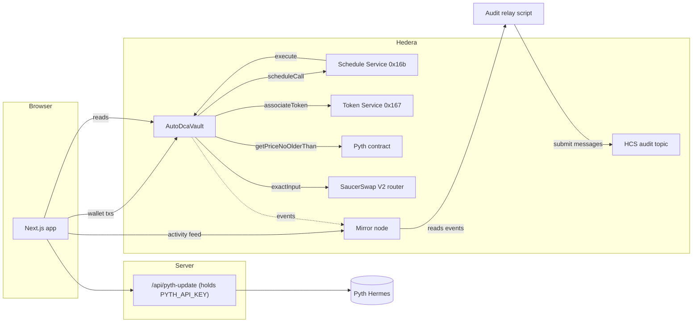
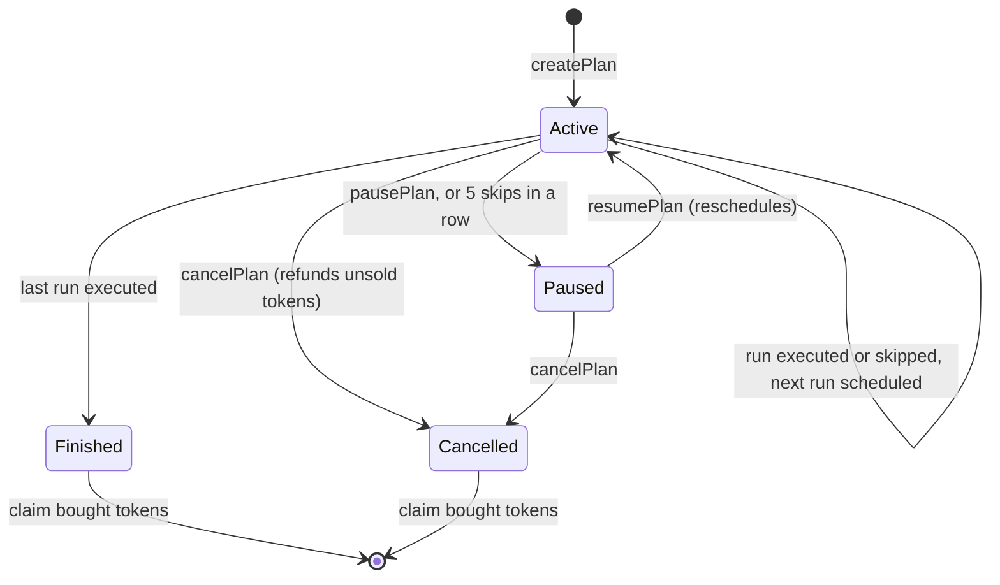

# Architecture

## Components



## One purchase, step by step

1. HSS calls `execute(planId)` at the scheduled second. Anyone may also call it once the plan is due.
2. If the plan is cancelled, finished or paused, the call returns silently.
3. If called too early (more than 2 seconds before `nextRunAt`) it reverts with `NotDue`. That check is also what makes duplicate schedules harmless.
4. `_evaluate` reads both Pyth prices and returns either a skip reason or the oracle-implied output and the slippage-adjusted floor.
5. On `None`, `_trySwap` approves the router for exactly one purchase, calls `exactInput` with the floor as `amountOutMinimum`, then resets the approval to zero. A revert is caught and becomes a `SwapFailed` skip.
6. A success updates accounting and emits `RunExecuted`. A skip emits `RunSkipped`.
7. `_scheduleNext` asks HSS for the next second, probing `hasScheduleCapacity` and moving forward up to 10 seconds if a second is busy. If scheduling fails the plan stays active with `scheduled = false` and a `ScheduleFailed` event.

## Plan state machine



## Oracle maths

For each token, a Pyth price `p * 10^expo` is normalised to a USD price with 18 decimals. For `amountIn` raw units of the sold token:

```
expectedOut = amountIn * 10^decimalsOut * priceIn / (priceOut * 10^decimalsIn)
floor       = expectedOut * (10000 - maxSlippageBps) / 10000
```

The computation uses a 512-bit `mulDiv` and the library never reverts: bad data returns a flag and the vault records a skip.

## Design decisions

- **Funds are escrowed up front.** A plan cannot overspend and a failed run never needs a top-up.
- **Output stays in the vault until claimed.** Swaps never fail because the owner forgot to associate the bought token, and cancelling never depends on that association.
- **No `deleteSchedule` call.** Stale schedules are neutralised by state checks instead, which avoids depending on one more system-contract call.
- **Low-level calls to system contracts.** HSS and HTS report failure through response codes. Low-level calls let the vault inspect them instead of reverting, which is why a scheduling failure degrades gracefully.
- **Two networks, one registry.** `packages/config` is imported by both Hardhat and Next.js, so addresses cannot drift.

## Optional HCS audit relay

Contracts in this template do not write to HCS. The relay (`packages/hardhat/scripts/auditRelay.ts`) closes that gap off-chain:

1. Read the vault's logs from the mirror node, oldest first, starting after a saved cursor.
2. Decode each log with the compiled ABI and keep only plan-story events (`RunExecuted`, `RunSkipped`, `PlanCreated`, and so on).
3. Publish each as a JSON message (under 1000 bytes) to a topic whose **submit key is the relay's key**, so only the relay can write to it.
4. Save the cursor after every message.

**Why the cursor is `(timestamp, index)`:** all logs from one transaction share a consensus timestamp. A timestamp-only cursor would skip the remaining logs of a transaction if the relay stopped halfway through it. The query uses `gte` and the script filters by index locally.

**Guarantees:** at-least-once delivery. A crash between publishing and saving can duplicate one record, never lose one. Records carry `txHash`, `event` and `planId` for de-duplication and for cross-checking against the mirror node.
